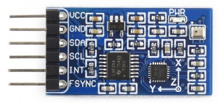

# STM32 - FC
STM32 based Quadcopter/Drone Flight Controller
___
This project is work in progress. 
Over the coming months I will be building out the software required to pilot a quadcopter. I will endeavour to keep the software as tidy as possible and to list the components I am using and link out to documentation that I find helpful.

If you have any questions please reach out, this is only a hobby project, so please don't expect me to do it for you ;) But we can all learn from each other :)

Thank you

Guy
___

# Controller Hardware
## STM32 Nucleo - STM32L152RE 


* [Link to STM32 site for STM32L152RE](https://www.st.com/en/evaluation-tools/nucleo-l152re.html)
* [MBED site, great for pin out diagrams](https://os.mbed.com/platforms/ST-Nucleo-L152RE/)

This is only a 32MHz processor, I am hoping it will be enough, if not i'll need to upgrade, I have seen others use an F4 72MHz version.

# IMU - Inertial Measurement Unit

This device allows us to track the movement of the quadcopter in space allowing us to always know it's pitch, roll and yaw from an initial starting point.
This is important as it allows the software to compensate or even control the quadcopter.

## Waveshare 10 DOF IMU Sensor (D)


* [Development Resources](https://www.waveshare.com/wiki/10_DOF_IMU_Sensor_(D))

Note: I think there is now a newer version of this sensor available!

This device has an I2C interface making it very easy to read the values, also included in the development resources is an IMU faction.
I have currently chosen to use the Waveshare IMU faction as it appear better than the version I was intending to write. 
However, I suggest watching some YouTube videos to understand how it works and its limitations.

# RC Receiver


# Reg/Green LED Status Module


# Quadcopter Frame
Since I have a 3D printer I decided to print my own frame. There are lots of suitable frames on [Thingiverse.com](https://www.thingiverse.com/). 
The one I chose appears simple to print and symmetrical, hopefully making it easier to control.

This is the main chassis I used [https://www.thingiverse.com/thing:1206960](https://www.thingiverse.com/thing:1206960),  
however, I used this arm that prints better: [https://www.thingiverse.com/thing:2867221](https://www.thingiverse.com/thing:2867221).

# Software Layout
I tend to separate my code into layers, for me there are three layers and the STM32 help keep this tidy.

**Layer 1 - HAL**: This is the Hardware Abstraction Layer, it uses the libraries provided by ST. It also sets up how the various interfaces are configured. What this layer is not responsible for is what is connection to the interface.

**Layer 2 - Hardware Layer:** This layer is concerned with the connected hardware and how it needs to be interfaced with.

**Layer 3 - Application:** This layer is the business logic, it does not care how to turn an LED on or off, only that the LED has to be turned on or off!

For Example, lets stick with a Green and Red status LED for this example.

**Layer 1:** Defines the GPIO Port and Pins for both the Red and Green LED
```c
#define LED_GREEN_Pin GPIO_PIN_5
#define LED_GREEN_GPIO_Port GPIOA
```
**Layer 2:** This layer has methods turn the LED(s) on or off. The exact way you use this later will depend on your use case. 
```c
void HardwareLayer_LED_Green_On(void);
void HardwareLayer_LED_Green_Off(void);

# or
void HardwareLayer_LED_Green(bool state);

#or
void HardwareLayer_LED_State(ledEnum led, bool state);
```
**Layer 3:** This last layer now only has to call a nicely wrapped function, thus keeping you code much more readable.


# TODO

* Altitude does not appear to be working.
* Red/Green LED Module (GPIO)
* LiPo Fuel gauge (ADC)
* 
* 